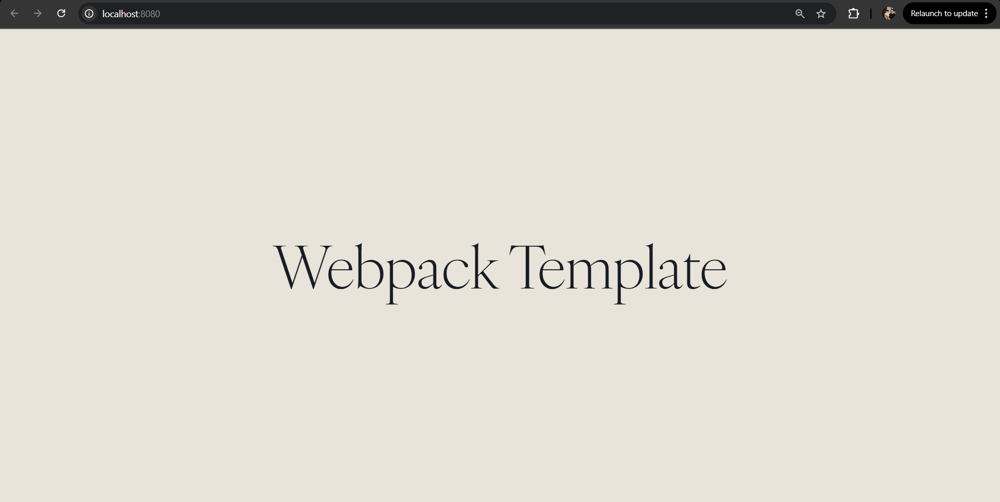

# Webpack Template


A pre-configured Webpack template with dev/prod modes, live reload, and deploy script.

---

## Features

- **Dev/Prod Mode** separation with `webpack-merge`
- Support for **CSS** via `style-loader` & `css-loader`
- Asset handling for **images**, **fonts**, and **HTML**
- **Hot Module Reloading** in development
- Optimized production build with asset cleaning
- Ready for **GitHub Pages** deployment via `npm run deploy`

## Folder Structure

```txt
webpack-template/
├── dist/                  # Production build (auto-generated)
├── node_modules/          # Installed dependencies (auto-created after npm install)
├── src/
│   ├── assets/            # Static assets (images, icons, etc.)
│   ├── fonts/             # Optional: custom web fonts
│   ├── modules/           # Optional: JS modules/components
│   ├── styles.css         # Global styles
│   ├── template.html      # HTML template
│   └── index.js           # App entry point (your main JS file)
├── .gitignore
├── package.json           # Project config and scripts (must be edited before npm install)
├── webpack.common.js      # Shared Webpack config
├── webpack.dev.js         # Development config
├── webpack.prod.js        # Production config
└── README.md

```

## Usage

###  Clone the Repository

```bash
git clone https://github.com/ali5917/webpack-template.git
cd webpack-template
rm -rf .git
```

###  Customize `package.json` Before Installing
**Make sure to do this before running `npm install`.**

```json
{
  "name": "your-project-name",
  "description": "Your project description",
  "author": "Your name",
  "keywords": ["custom", "tags", "for", "your", "project"],
  "repository": {
    "url": "https://github.com/your-username/your-repo-name.git"
  },
  "bugs": {
    "url": "https://github.com/your-username/your-repo-name/issues"
  },
  "homepage": "https://github.com/your-username/your-repo-name#readme"
}
```

###  Install Dependencies

```bash
npm install
```

###  Start Development Server

```bash
npm run dev
```
* Starts webpack-dev-server
* Opens your browser with live reloading
* Uses `webpack.dev.js`

###  Build for Production

```bash
npm run build
```
* Compiles and minifies code
* Outputs to the `/dist` folder
* Uses `webpack.prod.js`

### Deploy to GitHub Pages

```bash
npm run commit-dist
npm run deploy
npm run clean-dist-commit
```
- Temporarily commits the `/dist` folder built after `npm run build`
- Pushes `dist` to the `gh-pages` branch using git subtree
- Reverts the temporary commit and removes `/dist` to keep `main` clean

## npm Scripts Summary

|             Script             |               Description              |
| ------------------------------ |:--------------------------------------:|
| ``npm run test``               | Placeholder for tests (not required)   |
| ``npm run dev``                | Start dev server with hot reload       |
| ``npm run build``              | Bundle for production                  |
| ``npm run commit-dist``        | Temp commit of `/dist` for deployment  |
| ``npm run deploy``             | Push ``/dist`` to `gh-pages` branch    |
| ``npm run clean-dist-commit``  | Revert temp commit and remove ``/dist``|

## License

[MIT](LICENSE) © Ali Kashif — [@ali5917](https://github.com/ali5917)

## Template Preview

